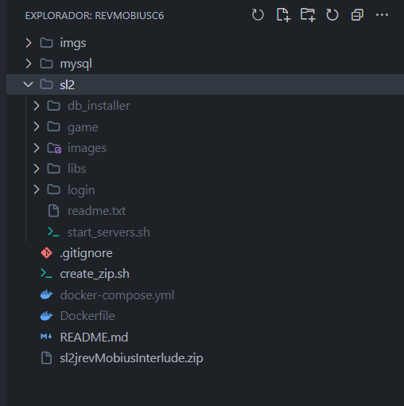
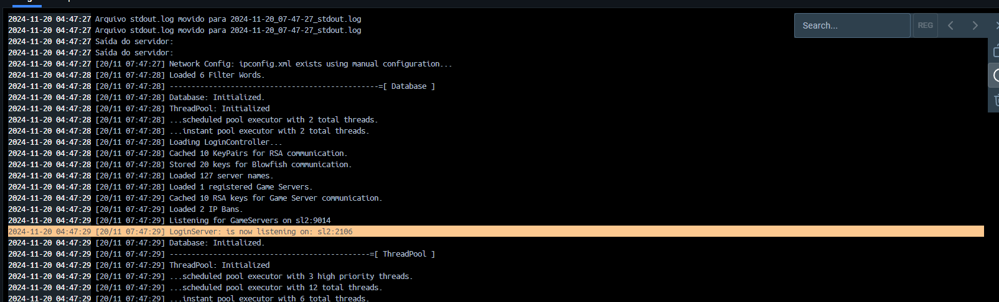
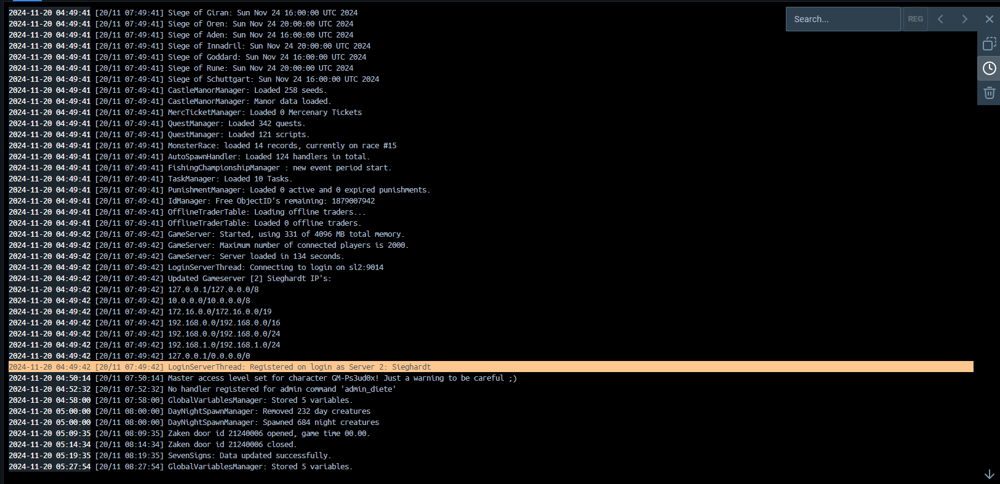

## REQUIREMENTS

``` 
 - Sistema operacional compatível com DOCKER OS Linux, Windows ou Mac(Não testado).
 - Instalar docker e docker-compose
    -> Windows: https://www.docker.com/products/docker-desktop/
    -> Linux: https://docs.docker.com/engine/install/ubuntu/
 - Git
 - Noções básicas de Docker, Git, Bash , Linux ou Windows (Terminal)
 - Gerenciador de banco de dados  Navcat, DBeaver ou Workbench (SGBD)

```

---- 

## INSTRUÇÕES


#####  OBS: Todos os comando serão executados dentro do terminal Linux ou Windows

## 1 - CLONAR O REPOSITORIO

##### Estruture e Organize

* clone o repositorio
``` 
    git clone https://github.com/dyegoalves/l2jrevMobiusInterludeC6.git

    cd l2jrevMobiusInterludeC6
    
```


## 2 - DESCOMPRIME O ARQUIVO ZIP

 * No linux use o comando abaixo
``` 
    unzip sl2jrevMobiusInterlude.zip
```
 * No windows use o comando abaixo
``` 
    use winrar ou um programa de descompactar de sua preferência para descompactar o arquivo    
```

* Estrutura do projeto:



## 3 - INICIALIZACAO DO SERVE COM DOCKER


#### Comando de incializacao do servidor com docker
Esse comando deve ser executado no terminal do servidor com o docker e docker-compose instalado e onde podemos encontrar o arquivo docker-compose.yml, ele cria os container e inicia o Loginserver, Gameserver  e mysql(database).

    docker-compose up --build -d

Caso precise subir separados os container, execute os comandos abaixo:

    docker-compose up --build -d db

    docker-compose up --build -d sl2


----

## 4 - SAIDA ESPERADA PARA SUCESSO DO SERVIDOR NO TERMINAL

* LOGIN SERVER OK



* GAME SERVER OK 




## 5 - LOGS DO SERVIDOR EM DOCKER CONTAINER 
* COMANDS DE LOGS SERVIDOR (sl2) E BANCO DE DADOS (db) no terminal  

``` 


    docker-compose logs -f  sl2 

    docker-compose logs -f  db

``` 

----

## :: COMANDO PARA SERVICE CONTAINER DA BASE DE DADOS (OPCIONAL)

#### Entre no container db com comando abaixo 
    docker-compose exec db bash

#### De permisao para arquivo
    chmod 600 /root/.my.cnf

#### Entre no diretorio onde se encontra o arquivo database.sql
    cd /docker-entrypoint-initdb.d

#### Executar o comando abaixo para realizar o restore da base de dados criada para projeto l2 ex: l2jteste
    mysql {NOME DO BANCO} < database.sql

#### Executar o comando abaixo para realizar o backup (dump) da base de dados criado para servidor de l2jteste, ou nome definido na instalacao do server
    mysqldump {NOME DO BANCO} > database.sql


--- 

#### Zip controle de versão do code server para envio ao desenvolvedor

./create_zip.sh